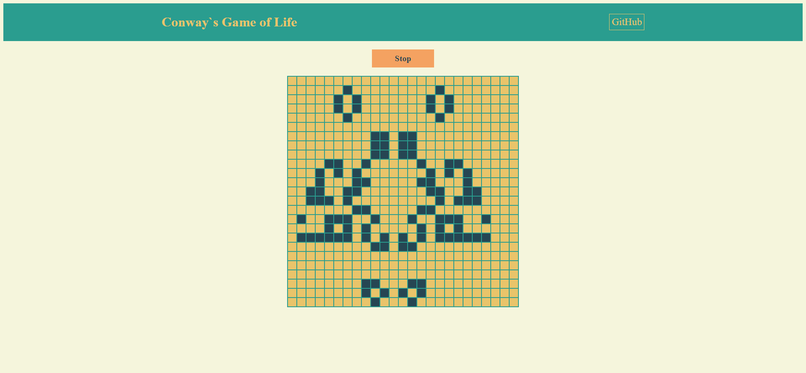

# Conways-Game-of-Life

Тестовая работа для компании "ИНИТИ". [Игра Жизнь](https://ru.wikipedia.org/wiki/%D0%98%D0%B3%D1%80%D0%B0_%C2%AB%D0%96%D0%B8%D0%B7%D0%BD%D1%8C%C2%BB) - игра разработанная в 70х годах.  
Правила игры: Нужно нажать на квадратики в поле и после нажать кнопку старт. Игра оживет, менясь и разрастаясь. Более подробно на [википедии](https://ru.wikipedia.org/wiki/%D0%98%D0%B3%D1%80%D0%B0_%C2%AB%D0%96%D0%B8%D0%B7%D0%BD%D1%8C%C2%BB) 
[DEMO](https://webbomj.github.io/Conways-Game-of-Life/) 

## Задание
Для игрового поля предлагается использовать эмуляцию поверхности тора (каждая крайняя правая клетка является соседом крайней левой клетки с тем же Y и каждая крайняя верхняя клетка является соседом крайней нижней клетки с тем же X). 
Поле может быть любых размеров. 
Генерацию первого поколения предлагаем сделать с помощью мыши. 

Реализация должна быть выполнена без привлечения сторонних библиотек. Для отображения можно использовать любой механизм вывода графики в тело веб страницы (html, canvas, canvas+webgl, svg). 
В остальных аспектах не ограничиваем ваш творческий потенциал. 

## Инструменты
1. Javascript
2. HTML/Css
